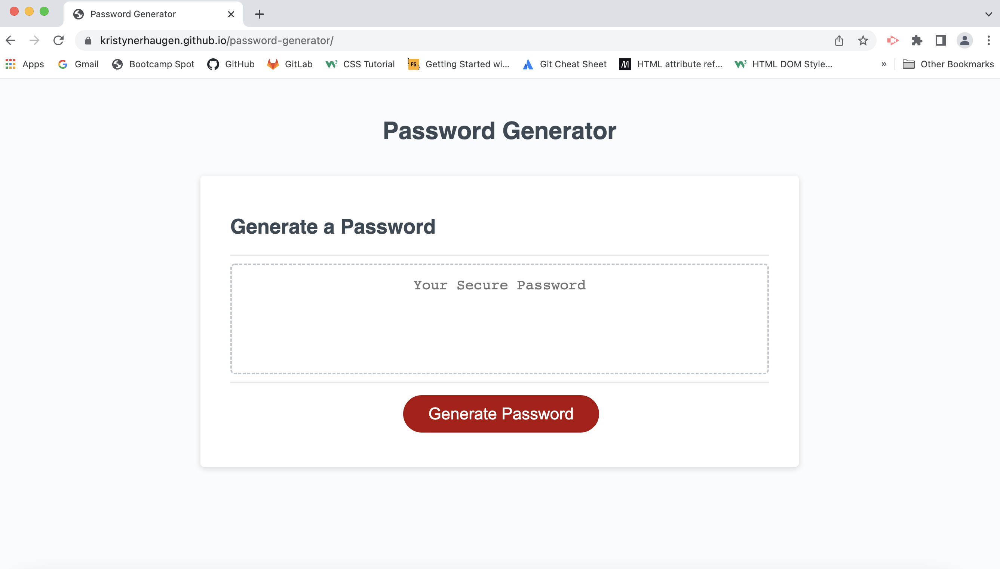

# Challenge Three: Password Generator

## For this challenge, I improved upon starter code to create an application that generates a random password. This random password is created using the criteria that that user selects. There are four criteria options: numbers, lowercase letters, uppercase letters, and special characters. The user selects their preferred criteria and then inputs how long they would like their password to be--anywhere between 8 and 128 characters. The starter code given for this project ensured a clean and responsive user interface. 

### This link will take you to the deployed application:

[See deployed site here](https://kristynerhaugen.github.io/password-generator/)

## Installation
### Access the code via GitHub. Install how you would usually install from a GitHub repository. 

## Usage
### This application is to be used to generate a random password between 8 and 128 characters in length. This random password can include numbers, upper case letters, lower case letters, and/or special characters. Please note this application displays the generated password in visible text, which could be a security issue if used to generate a password that needs to be secure. 

### This image shows the deployed site:
#### 

## Credits 
### The starter code, including HTML, CSS, and starter JS, was provided to me by Trilogy Education Services, LLC. I added to this starter code by using what I learned in the BootCamp Spot modules and information I learned in BootCamp classes. I often referred to the code used and information presented in Module 3. I used the website https://developer.mozilla.org/en-US/docs/Web/JavaScript/Reference/Global_Objects/Array/@@iterator  to better understand arrays. I used the website https://developer.mozilla.org/en-US/docs/Web/JavaScript/Reference/Global_Objects/Math/random to better understand randomizing data in arrays. I used the website https://www.w3schools.com/js/js_loop_for.asp to help me understand loops. To help me understand if, else, else if, and switch statements, I used this website: https://www.w3schools.com/js/js_if_else.asp. My Boot Camp tutor, Rebecca Burke, helped me with pseudocode and basic understanding for this project. Boot Camp TA Chris Stallcup helped me get unstuck when I was trying to get a password to generate. Boot Camp TA Jessica Guico helped me figure out why my application was always generating one extra character and assisted me with fixing this error. 

## License
- - -
© 2022 Trilogy Education Services, LLC, a 2U, Inc. brand. Confidential and Proprietary. All Rights Reserved.
